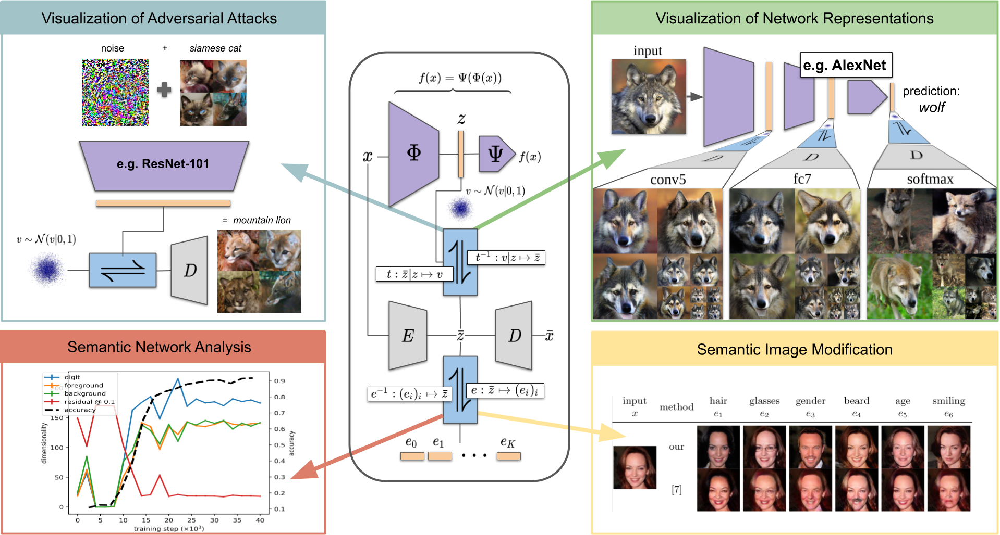

# Making Sense of CNNs: Interpreting Deep Representations & Their Invariances with Invertible Neural Networks

PyTorch code accompanying the [ECCV 2020](https://eccv2020.eu/) paper

[**Making Sense of CNNs: Interpreting Deep Representations & Their Invariances with Invertible Neural Networks**](https://compvis.github.io/invariances/)<br/>
[Robin Rombach](https://github.com/rromb)\*,
[Patrick Esser](https://github.com/pesser)\*,
[Björn Ommer](https://hci.iwr.uni-heidelberg.de/Staff/bommer)<br/>
\* equal contribution

<br/>
[arXiv](https://arxiv.org/) | [BibTeX](#bibtex) | [Project Page](https://compvis.github.io/invariances/)

Table of Contents
=================

* [Requirements](#requirements)
* [Demos](#demos)
* [Training](#training)
   * [Data](#data)
   * [Invariances of Classifiers](#invariances-of-classifiers)
      * [ResNet](#resnet)
      * [AlexNet](#alexnet)
* [Evaluation](#evaluation)
* [Pretrained Models](#pretrained-models)
* [BibTeX](#bibtex)


## Requirements
A suitable [conda](https://conda.io/) environment named `invariances` can be created
and activated with:

```
conda env create -f environment.yaml
conda activate invariances
```

Optionally, you can then also `conda install tensorflow-gpu=1.14` to speed up
FID evaluations.

## Demos
To get started you can directly dive into some demos. After installing the requirements as described
above, simply run

```
streamlit run invariances/demo.py
```

Please note that checkpoints will be downloaded on demand, which can take a while. You can see
the download progress displayed in the terminal running the streamlit command. 

We provide demonstrations on

- visualization of adversarial attacks
- visualization of network representations and their invariances
- revealing the texture bias of *ImageNet*-CNNs
- visualizing invariances from a video (resulting in image to video translation)
- image mixing via their network representations

Note that all of the provided demos can be run without a dataset, and you can add 
your own images into `data/custom`.


## Training

### Data
If not present on your disk, all required datasets (*ImageNet*, *AnimalFaces* and *ImageNetAnimals*)
 will be downloaded and prepared automatically. The data processing and loading rely on the
  [autoencoders](https://github.com/edflow/autoencoders) package and are described in more detail 
  [here](https://github.com/edflow/autoencoders#data).
  
  **Note:** If you already have one or more of the datasets present, follow the instructions linked 
  above to avoid downloading them again.
 

### Invariances of Classifiers

#### ResNet

To recover invariances of an ResNet classifier trained on the [AnimalFaces](https://github.com/edflow/autoencoders#animalfaces)
 dataset, run

```
edflow -b configs/resnet/animalfaces/base.yaml configs/resnet/animalfaces/train/<layer>.yaml -t
```

where `<layer>` is one of `input`, `maxpool`, `layer1`, `layer2`, `layer3`, `layer4`, 
`avgpool`, `fc`, `softmax`.
To enable logging to [wandb](https://wandb.ai), adjust
`configs/project.yaml` and add it to above command:

```
edflow -b configs/resnet/animalfaces/base.yaml configs/resnet/animalfaces/train/<layer>.yaml configs/project.yaml -t
```

#### AlexNet

To reproduce the training procedure from the paper, run

```
edflow -b configs/alexnet/base_train.yaml configs/alexnet/train/<layer>.yaml -t
```

where `<layer>` is one of `conv5`, `fc6`, `fc7`, `fc8`, `softmax`.
To enable logging to [wandb](https://wandb.ai), adjust
`configs/project.yaml` and add it to above command:

```
edflow -b configs/alexnet/base_train.yaml configs/alexnet/train/<layer>.yaml configs/project.yaml -t
```


## Evaluation

Evaluations run automatically after each epoch of training. To start an
evaluation manually, run

```
edflow -p logs/<log_folder>/configs/<config>.yaml
```

and, optionally, add `-c <path to checkpoint>` to evaluate a specific
checkpoint instead of the last one.


## Pretrained Models
Pretrained models (e.g. autoencoders and classifiers) will be downloaded automatically on their first 
use in a demo, training or evaluation script. 

## BibTeX

```
@inproceedings{rombach2020invariances,
  title={Making Sense of CNNs: Interpreting Deep Representations \& Their Invariances with INNs},
  author={Rombach, Robin and Esser, Patrick and Ommer, Bj{\"o}rn},
  booktitle={Proceedings of the European Conference on Computer Vision},
  year={2020}
}
```
